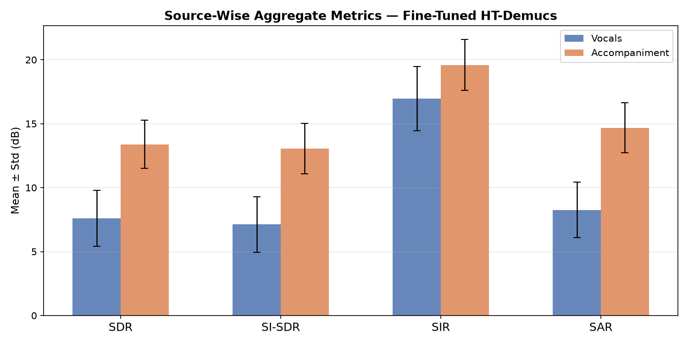
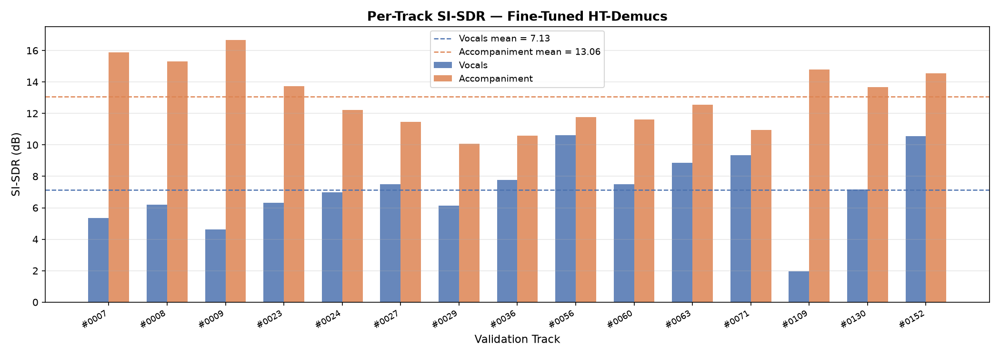
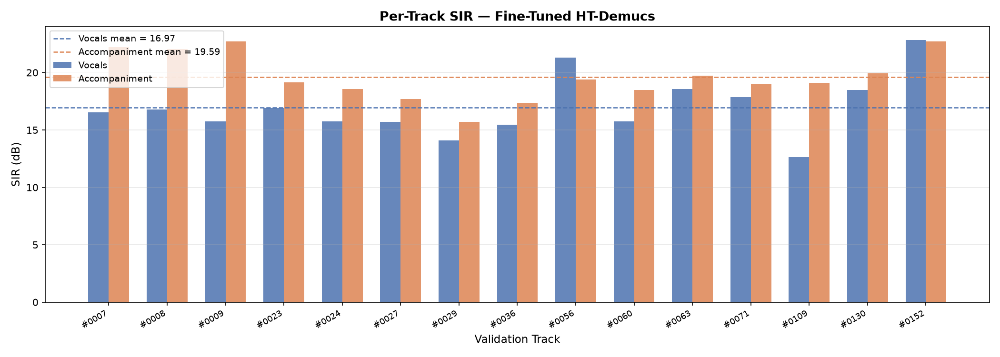
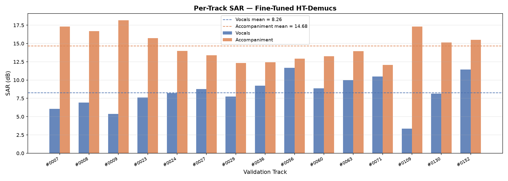
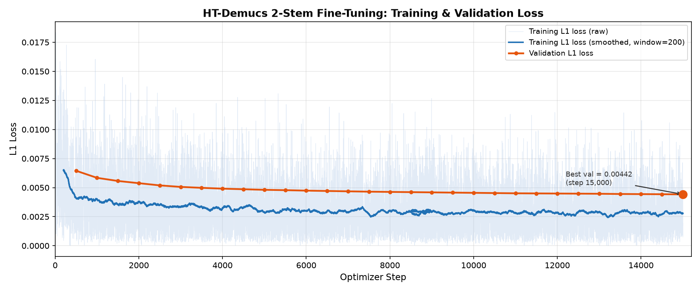
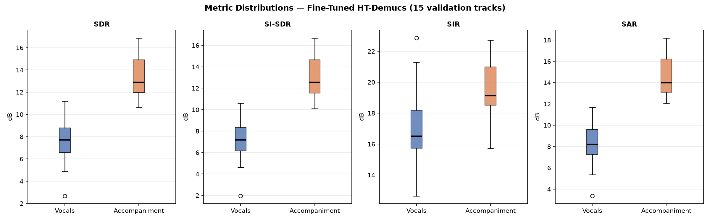

# Fine-Tuned HT-Demucs Model Evaluation Report

## 1. Purpose

The purpose of this report is to present the objective evaluation of the finalized fine-tuned 2-stem HT-Demucs model. This model has been adapted to the domain of Indian classical and folk music using the Saraga dataset. 

This evaluation assesses the source-separation quality of the model using standard metrics on a held-out set of audio tracks. This is explicitly a regression/source-separation evaluation, not a classification evaluation.

## 2. Final Model

- **Model/Checkpoint Path**: `D:\finetune_htdemucs_runs\run_002\best.pt`
- **Checkpoint Step**: 15,000
- **Base Architecture**: HT-Demucs (Hybrid Transformer Demucs)
- **Stem Configuration**: 2-stem
- **Sources**: 
  - `vocals`
  - `accompaniment`

## 3. Evaluation Dataset

- **Dataset**: Saraga corpus
- **Split**: Validation (`D:\dataset_prepared_saraga\valid`)
- **Number of Tracks**: 15
- **Track Structure**: Each track contains `mixture.wav` (input), `vocals.wav` (reference), and `accompaniment.wav` (reference).

## 4. Evaluation Methodology

For each of the 15 validation tracks, the mono `mixture.wav` input was evaluated against the isolated mono `vocals.wav` and `accompaniment.wav` references.

- **Model Inference**: Inference was performed using `demucs.apply.apply_model` with the model's internal segment length of 7.8 seconds, utilizing 25% overlap-add chunking. 
- **Channel Handling**: Because the model expects stereo inputs natively, the mono mixture was dynamically duplicated to two channels (`[1, 2, N]`) during inference to match the training-time convention. The resulting stereo output channels were then averaged back into mono before metric calculation, ensuring alignment with the natively mono reference signals.
- **Signal Alignment**: Both reference and estimated signals were trimmed to their minimum shared length to ensure exact sample alignment.
- **Metric Calculation**: Metrics were computed jointly on both sources using the `mir_eval 0.8.2` library (`bss_eval_sources`) to correctly evaluate cross-source interference.

## 5. Objective Metrics

The evaluation employs four standard objective metrics for source separation. 

- **SDR (Signal-to-Distortion Ratio)**: Measures overall separation quality by comparing the energy of the desired source against the combined energy of all distortion and error components. Higher is better.
- **SI-SDR (Scale-Invariant Signal-to-Distortion Ratio)**: Evaluates source reconstruction quality similarly to SDR, but is invariant to overall amplitude scale differences between the estimate and the reference. Higher is better.
- **SAR (Sources-to-Artifacts Ratio)**: Measures the amount of artificial algorithmic artifacts (e.g., "musical noise" or burbling) introduced into the estimated source, independent of interference from other sources. Higher is better.
- **SIR (Sources-to-Interferences Ratio)**: Measures the suppression of interference from the other sources (leakage). Higher is better.

*(Note: Classification terminology such as accuracy, precision, and recall are mathematically inapplicable to continuous audio-waveform reconstruction and are not used here.)*

## 6. Aggregate Results

The following table presents the aggregate metric results across all 15 validation tracks. Both mean and median values are reported.

| Metric | Vocals (Mean) | Vocals (Median) | Accompaniment (Mean) | Accompaniment (Median) |
|--------|---------------|-----------------|----------------------|------------------------|
| **SDR** | 7.59 dB | 7.71 dB | 13.39 dB | 12.90 dB |
| **SI-SDR** | 7.13 dB | 7.17 dB | 13.06 dB | 12.57 dB |
| **SIR** | 16.97 dB | 16.52 dB | 19.59 dB | 19.13 dB |
| **SAR** | 8.26 dB | 8.21 dB | 14.68 dB | 13.99 dB |

## 7. Per-Track Results

The evaluation metrics were calculated for all 15 validation tracks and both sources. The complete machine-readable raw values are available at:
`tables/per_track_metrics.csv`

The following plots visualize the per-track performance for each of the four metrics:

## 8. Training/Validation Behaviour

The finalized checkpoint corresponds to optimizer step 15,000, which recorded the lowest validation L1 loss (`0.00442`) achieved during the fine-tuning run. As shown in the plot, the validation loss was monotonically decreasing up to the 15,000-step termination boundary, indicating that the model did not formally converge or trigger early stopping. However, the model successfully learned a strong domain representation during this window.

## 9. Metric Distribution Analysis

The distribution of results across the 15 tracks shows moderate variance, reflecting the diverse acoustic conditions and instrumentation within the Saraga validation set. 

- Vocals SDR exhibits a standard deviation of 2.19 dB, ranging from ~2.68 dB to ~11.21 dB.
- Accompaniment SDR is generally tighter and higher overall, with a standard deviation of 1.88 dB, ranging from ~10.60 dB to ~16.86 dB.
- SIR values show strong overall suppression, though occasional outliers exist on the lower end.

## 10. Source-wise Analysis

In terms of the measured metrics, the model yields higher scores for the **Accompaniment** stem across all four dimensions (SDR, SI-SDR, SIR, and SAR) compared to the **Vocals** stem. 

This numerical differential is common in source-separation tasks where the accompaniment contains a majority of the broad-spectrum energy (e.g., percussion, drone, melodic support). The vocals, being sparse and highly dynamic, typically present a more challenging localized reconstruction task, yielding numerically lower SDR and SAR scores despite potentially strong perceptual separation.

## 11. Limitations

- **Validation Set Size**: The evaluation relies on 15 tracks from a single validation split.
- **Domain Generalization**: The validation tracks are from the Saraga corpus (identical domain to the training set). Objective performance on entirely out-of-domain Indian classical or folk recordings is unknown.
- **Mono Evaluation**: Both the fine-tuning and this evaluation were performed on natively mono audio (artificially duplicated for inference). Objective performance on genuine stereo mixes with spatial panning has not been evaluated.
- **Metric Limitations**: Objective metrics (SDR/SI-SDR) do not always correlate perfectly with human perceptual quality, particularly regarding the perceptual impact of subtle artifacts in vocal passages. 

## 12. Final Evaluation Summary

The final 2-stem fine-tuned HT-Demucs model was objectively evaluated on 15 held-out Indian music tracks. The model successfully separated the audio with a mean SDR of **7.59 dB** for vocals and **13.39 dB** for accompaniment, maintaining high interference suppression (SIR > 16.9 dB). All evaluation artifacts, tabular data, and generation scripts have been preserved for reproducibility.
