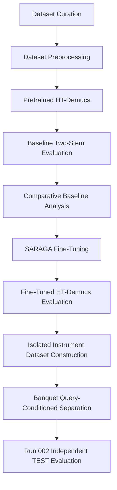
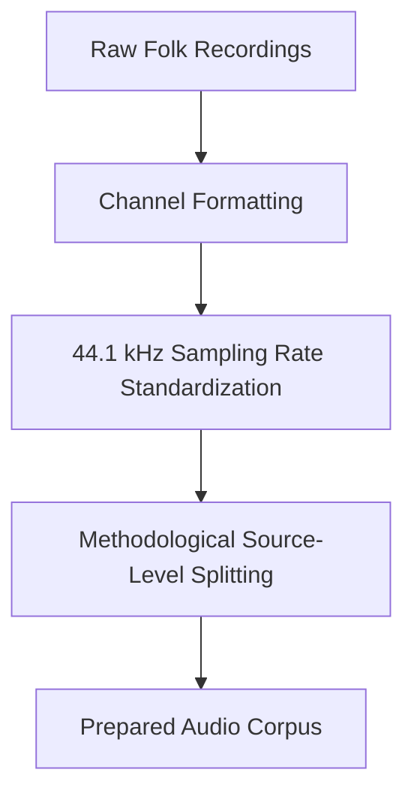
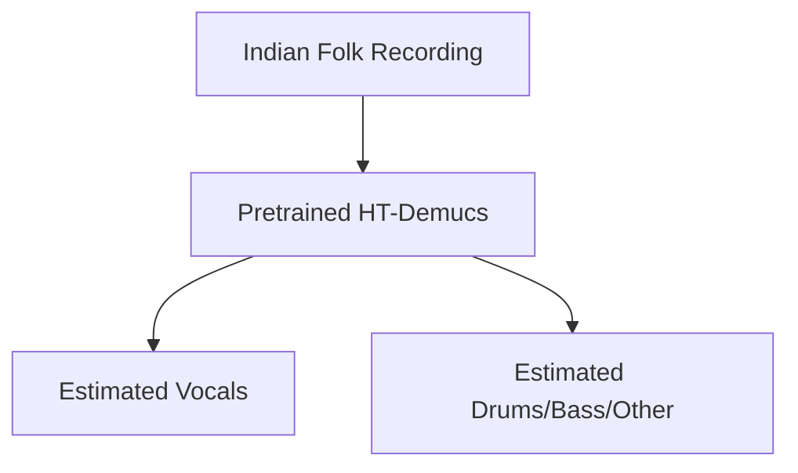
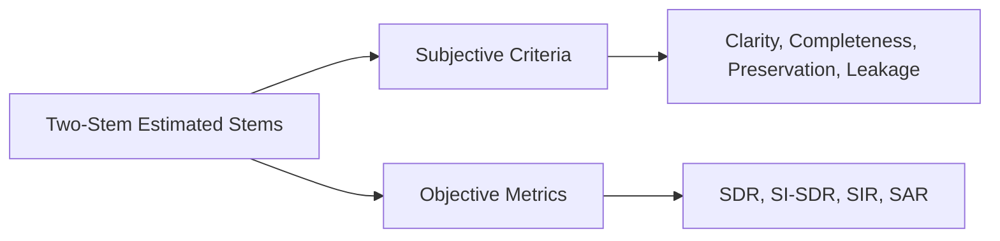
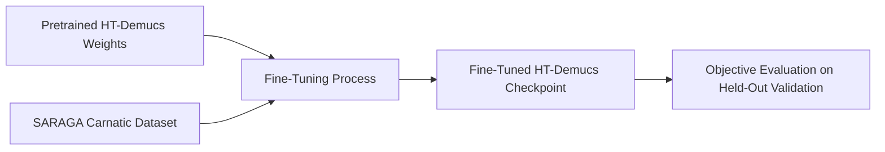
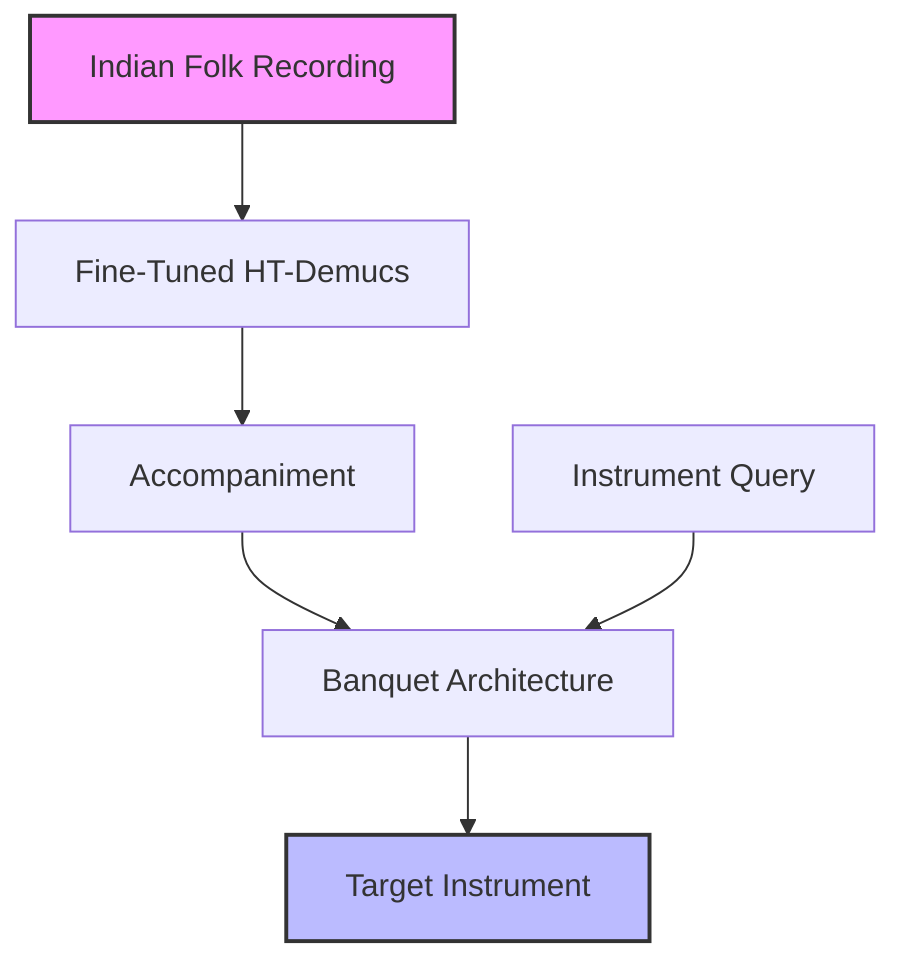
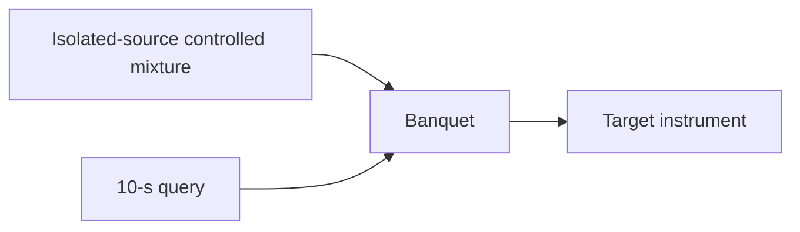

# IKS Internship: Complete Project Report
## Music Source Separation and Instrument Isolation for Indian Folk Music

**Prepared for:** Ministry of Education, IKS Division, NIT Silchar  
**Project Stage:** Final Comprehensive Mentor Report  
**Date:** August 2026  

---

## 1. Executive Summary

The Indian Knowledge Systems (IKS) Music Source Separation and Instrument Isolation project represents a systematic research effort to adapt modern neural audio architectures to the culturally distinct domain of Indian folk music. A substantial body of modern music source-separation research has been developed and evaluated using Western popular-music benchmarks such as MUSDB18, whose commonly used four-stem formulation comprises vocals, drums, bass, and other. 

Indian musical recordings can differ substantially from conventional Western popular-music datasets in their tonal organization, rhythmic structures, vocal ornamentation, and instrumentation, including the use of culturally specific percussion and melodic instruments. The project investigated the feasibility and practical limitations of source separation for Indian folk music through progressively controlled experiments, establishing useful vocal/accompaniment separation in the evaluated settings while demonstrating that individual-instrument separation remains strongly dependent on data availability, instrument class, and evaluation conditions.

The project did not simply aim to build a "better" separator; rather, we progressively investigated increasingly difficult levels of source separation in Indian music, with each stage addressing a specific unresolved limitation identified by the preceding stage. The investigation progressed systematically through dataset curation, evaluation of a pretrained HT-Demucs model, domain adaptation through two-stem fine-tuning, and finally query-conditioned individual-instrument extraction.

*(Figure 1: Complete research pipeline)*

## 2. Research Motivation and IKS Context

Music Information Retrieval (MIR) and generative audio research require high-quality isolated stems. However, applying pretrained source-separation models to Indian folk recordings can result in substantial source leakage, incomplete separation, and audible artifacts, particularly when the instrumentation differs from the source categories represented in the model's training domain. Because many instruments encountered in these traditions do not correspond directly to the predefined source categories of conventional music source-separation systems, a dedicated research pipeline was necessary to establish how these models behave under Indian-music conditions, and how they might be adapted to preserve culturally significant recordings.

## 3. Research Questions and Objectives

This project was guided by several core research questions:
- How effectively do pretrained general-purpose source-separation models generalize zero-shot to Indian folk music?
- Can subjective and objective metrics consistently quantify the domain gap?
- To what extent does domain-specific fine-tuning (using Indian classical music) produce measurable two-stem source separation performance on unseen data within the evaluated domain?
- Can a query-conditioned architecture (Banquet) successfully isolate individual Indian folk instruments from a complex mixture?
- What data and methodological limitations affect the feasibility of Indian folk music source separation within the evaluated experimental setting?

## 4. Initial Investigation of Indian Folk Traditions

### 4.1 Survey of candidate traditions
A broad set of candidate Indian folk traditions was initially surveyed. This broad sweep was necessary to understand the landscape of available audio and the diversity of acoustic properties across the Indian subcontinent.

### 4.2 Selection criteria
The candidate list was carefully narrowed based on strict criteria: availability of downloadable audio, dataset accessibility/licensing, recording audio quality, metadata quality, musicological richness, vocal prominence, instrument diversity, regional representation, and future computational usefulness.

### 4.3 Final ten traditions
The final corpus was curated from ten selected Indian folk traditions to provide geographic, cultural, vocal, and instrumental diversity within the practical scope of the study. The selection was intended to provide a diverse research corpus rather than a statistically representative sample of Indian folk music as a whole:
1. **Bihu** — Assam
2. **Baul Geet** — Bengal
3. **Maand** — Rajasthan
4. **Pandavani** — Chhattisgarh
5. **Yakshagana** — Karnataka
6. **Bhavageet/Bhavageethe** — Karnataka/Maharashtra
7. **Lavani** — Maharashtra
8. **Garba** — Gujarat
9. **Goalparia Lokgeet** — Assam
10. **Kajri** — Uttar Pradesh/Bihar

## 5. Dataset Curation and Development

*(Figure 2: Dataset curation workflow)*

### 5.1 Mixed Indian Folk Corpus
The project identified and curated recordings representing ten selected Indian folk traditions. The audio was collected from publicly accessible archives, online sources, and available regional dataset repositories, with some recordings retained specifically for exploratory or reference purposes. This mixed corpus was primarily used for investigation and baseline evaluation.

### 5.2 Metadata
To ensure the dataset remained scientifically useful, rigorous metadata tracking was implemented. Fields included the tradition, song ID, region, language, title, performer, vocal information, instrumentation, musical context, source URL, license/access information, duration, sample rate, format, raw filename, and processed filename.

### 5.3 Provenance
Provenance tracking was critical. Every collected audio file was strictly associated with its original recording source to prevent identical overlapping segments from accidentally contaminating both training and evaluation datasets in later machine-learning stages.

*(Figure 3: Dataset preprocessing pipeline)*

### 5.4 Audio preprocessing
Audio was standardized to the sampling-rate and channel requirements of the downstream processing pipeline; for the SARAGA fine-tuning stage, mono recordings were duplicated across channels to satisfy the model's stereo input requirement.

### 5.5 Dataset limitations
Because a suitable large-scale, high-quality, pre-formatted dataset meeting the requirements of this study was not readily available, the construction of a project-specific corpus was motivated. The limited availability of suitable high-quality multi-track and isolated-instrument recordings strongly motivated the use of controlled synthetic mixture generation in the later instrument-isolation experiments.

## 6. Pretrained HT-Demucs Baseline

*(Figure 4: Baseline HT-Demucs workflow)*

### 6.1 Model and task definition
The pretrained HT-Demucs model, a modern neural music source-separation architecture, was selected as a representative general-purpose model developed primarily around conventional Western music datasets and source categories. For the baseline experiments, the 4-stem output was mapped to a two-stem source separation task (Vocals vs. Accompaniment).

### 6.2 Baseline Experiments and Evidence
Several baseline inference runs (including recordings from the Bihu and Baul Geet traditions) were performed. These baseline experiments were crucial for understanding how the pretrained model responded to Indian folk material without any domain-specific adaptation, providing foundational baseline methodology, configuration, and comparative observations.

## 7. Subjective and Objective Baseline Evaluation

*(Figure 5: Evaluation framework)*

### 7.1 Subjective methodology
Separation quality cannot be fully captured by equations alone. Human listeners evaluated the two-stem source separation using formal criteria: Vocal Clarity, Vocal Completeness, Instrument Preservation, Timbre Preservation, Vocal Leakage, and Instrument Leakage.

### 7.2 Objective metrics
Evaluation metrics were selected according to the experimental stage. The two-stem HT-Demucs baseline and fine-tuning stages used objective source-separation measures including SDR, SI-SDR, SIR, and SAR where ground-truth reference sources were available, together with subjective listening-based assessment for the baseline experiments. The final Banquet Run 002 TEST evaluation primarily reported SDR for positive target extraction and mean negative-query RMS for absent-target suppression. Training and validation L1SNR values were used for optimization and checkpoint selection rather than being treated as direct perceptual separation-quality measures.

### 7.3 Findings
The subjective observations were broadly consistent with the patterns reflected in the objective metrics, particularly in cases where leakage and artifacts were audibly apparent. While vocals were frequently extracted with reasonable clarity, traditional percussive and melodic accompaniment consistently leaked into the estimated vocal stem.

## 8. Comparative Baseline Analysis

### 8.1 Cross-recording behaviour
A comparative analysis was performed across the evaluated baseline recordings to characterize how consistently the pretrained HT-Demucs model separated vocals and accompaniment under different Indian folk-music conditions. The purpose was to characterize domain behavior rather than to rank competing separation models. The performance fluctuated significantly depending on the specific recording quality and the density of the traditional instrumentation.

### 8.2 Cross-tradition observations
The baseline evaluation indicated a mismatch between the source categories represented by the pretrained separation model and the instrumentation encountered in the evaluated Indian folk-music recordings. This mismatch was reflected in inconsistent allocation of instrumental content between the vocal and accompaniment stems and recurring interference from non-vocal sources. The subsequent fine-tuning experiments were therefore designed to examine whether adaptation to culturally relevant musical material could improve separation behaviour.

### 8.3 Implications
Pretrained HT-Demucs provided useful two-stem source separation on the evaluated Indian folk recordings, but recurring instrument leakage and variation across recordings indicated a domain mismatch that motivated subsequent Indian-music adaptation.

## 9. HT-Demucs Fine-Tuning on SARAGA

*(Figure 6: SARAGA fine-tuning pipeline)*

### 9.1 Motivation
To reduce the domain mismatch identified in the baseline stage, the project undertook supervised fine-tuning of the HT-Demucs weights using Indian classical music.

### 9.2 Dataset
The SARAGA Carnatic dataset was selected because it provides professional, multi-track studio recordings containing isolated ground-truth stems (e.g., isolated vocals and accompaniment) required for supervised adaptation. The SARAGA Carnatic dataset was used specifically for fine-tuning HT-Demucs to investigate adaptation toward Indian/Carnatic musical characteristics.

### 9.3 Two-stem formulation
The architecture was configured strictly for a two-stem source separation task (Vocals vs. Accompaniment) to align directly with the SARAGA ground truth.

### 9.4 Training
The model, initialized from pretrained weights, was fine-tuned for 15,000 steps utilizing 145 training tracks and 15 validation tracks. The final selected checkpoint achieved a validation L1 loss of approximately 0.0044158. It is important to note that this validation loss is strictly a training convergence metric, not an objective separation quality metric (such as SDR).

### 9.5 Objective evaluation
The domain-adapted model was objectively evaluated on the 15 held-out SARAGA validation tracks to measure actual two-stem source separation performance. The fine-tuned model achieved a Mean Vocals SDR of 7.59 dB (SIR: 16.97 dB) and a Mean Accompaniment SDR of 13.39 dB (SIR: 19.59 dB).

### 9.6 Interpretation and limitations
Fine-tuning HT-Demucs on the SARAGA Carnatic dataset demonstrated effective two-stem adaptation within the evaluated SARAGA domain, with objective evaluation performed on held-out recordings from that corpus. These results support the usefulness of Indian-music domain adaptation for the evaluated vocal/accompaniment task, but do not by themselves establish universal generalization across Indian folk traditions.

## 10. Transition to Instrument-Level Separation

*(Figure 7: HT-Demucs to Banquet transition/cascade - RESEARCH CONCEPT)*

### 10.1 Why two-stem separation was insufficient
While isolating the vocal track is valuable, the resulting "accompaniment" stem remains a dense, multi-instrument mixture. Supporting detailed Music Information Retrieval or generative instrument replacement requires isolating individual instruments (e.g., separating the flute from the tabla).

### 10.2 Isolated Instrument Corpus problem
Because the curated folk recordings did not provide sufficient isolated ground-truth stems for directly supervised instrument-level training, the project assembled a secondary library of isolated Indian-instrument recordings and used these recordings to construct controlled synthetic mixtures with known source targets.

## 11. Query-Conditioned Banquet Methodology

*(Figure 8: Banquet instrument-separation workflow - QUANTITATIVE TEST)*

### 11.1 Architecture concept
The project subsequently extended the investigation from two-stem vocal/accompaniment separation to query-conditioned instrument isolation using the Banquet architecture. The conceptual research pipeline was formulated as a cascade in which Indian folk recordings could first undergo vocal/accompaniment separation using the fine-tuned HT-Demucs model, after which a query-conditioned Banquet model could be used to target an individual instrument. However, the final quantitative Run 002 evaluation was conducted on controlled synthetic instrument mixtures with isolated ground-truth sources and was therefore an evaluation of the query-conditioned instrument-separation stage rather than a quantitative end-to-end evaluation of the complete HT-Demucs → Banquet cascade on naturally recorded folk mixtures.

### 11.2 Dynamic mixture generation
During training, dynamic synthetic mixtures were generated by combining isolated instrument stems. 

### 11.3 Query construction
The model was provided with a 10-second reference audio query corresponding to the target instrument to be extracted from the 6-second mixture.

### 11.4 Negative queries
Negative-query examples were included to evaluate and encourage suppression of target output when the queried instrument was absent from the mixture. A potential failure mode in query-conditioned separation is spurious target output when the queried instrument is absent from the mixture.

### 11.5 Source-level splitting
The splitting strategy was designed and programmatically audited to prevent source-level and temporal leakage. For same-source positive examples, source recordings were required to provide sufficient duration to construct a 10-second query segment and a separate 6-second mixture segment without temporal overlap. This was used to prevent trivial temporal leakage between the query and target mixture.

### 11.6 Validation and test design
The dataset strictly enforced the following structure:
- **TRAIN:** Dynamic synthetic mixtures for model optimization.
- **VALIDATION:** Fixed deterministic samples for checkpoint selection.
- **TEST:** Completely strictly held-out for final independent evaluation.

## 12. Initial Banquet Experiment

Run 001 served as an exploratory feasibility experiment for query-conditioned extraction of Indian instruments from controlled mixtures. The observed class-dependent variation in extraction quality motivated the more controlled validation, leakage prevention, and negative-query evaluation procedures adopted for Run 002.

## 13. Final Controlled Instrument-Separation Evaluation

### 13.1 Run 002 methodology
The Run 002 checkpoint at global step 2600 was selected using the predefined fixed validation procedure, based on improvement in the primary validation L1SNR objective while satisfying the negative-query RMS safety constraint.

VALIDATION was used for checkpoint selection.
TEST was independently held out and used only for final evaluation.

Validation:
Baseline L1SNR = -2.219
Run 002 best L1SNR = -2.609

Validation:
Baseline SDR = -1.564 dB
Run 002 best SDR = -1.674 dB

TEST:
Baseline SDR = 2.225 dB
Run 002 SDR = 4.222 dB

L1SNR was used as the training/validation optimization objective and should not be interpreted as a direct measure of perceptual separation quality. Final separation quality was assessed independently using the held-out TEST evaluation.

### 13.2 Independent TEST evaluation
The final checkpoint was subsequently evaluated on a strictly held-out TEST set containing controlled instrument-separation examples constructed from sources assigned exclusively to the TEST split. The evaluation compared the baseline checkpoint with the fine-tuned Run 002 checkpoint under the same TEST conditions. The primary positive-query separation metric reported for this final experiment was SDR, while mean negative-query RMS was used to characterize target suppression for absent-query cases.

### 13.3 Main findings
Run 002 provided evidence that query-conditioned fine-tuning can improve instrument extraction under the controlled mixture conditions evaluated. 

TEST SET

Global Positive SDR:
Baseline = 2.225 dB
Run 002 = 4.222 dB
Absolute change = +1.997 dB

Global Positive L1SNR:
Baseline = -3.023
Run 002 = -4.285
Absolute change = -1.262

Global Mean Negative RMS:
Baseline = 0.0205
Run 002 = 0.0195

Per-instrument Positive SDR:

Tabla:
Baseline = 0.909 dB
Run 002 = 0.857 dB
Change = -0.052 dB

Flute:
Baseline = 3.421 dB
Run 002 = 7.281 dB
Change = +3.860 dB

Negative RMS:

Tabla:
Baseline = 0.0344
Run 002 = 0.0380

Flute:
Baseline = 0.0016
Run 002 = 0.0015

Dholak:
Baseline = 0.0293
Run 002 = 0.0292

Dhul:
Baseline = 0.0166
Run 002 = 0.0097

The experiments provide evidence that query-conditioned instrument separation can be applied to selected Indian folk-music instrument recordings and can produce measurable improvements on unseen test mixtures for the instrument cases represented in the final TEST inventory.

### 13.4 Data availability limitations
Positive TEST-set SDR results were not available for Harmonium, Dholak, and Dhul because the final TEST inventory did not contain sufficient positive query cases for these instruments. Consequently, no positive-separation performance claim is made for these instruments.

## 14. Key Lessons from the Investigation

The investigation suggests that the practical bottleneck is not solely architectural. Data availability, source diversity, isolated-stem availability, class imbalance, recording variability, and the mismatch between pretrained source categories and Indian instrumentation substantially influence what can be evaluated and what can be learned. The progression from zero-shot HT-Demucs to Indian-music domain adaptation and finally query-conditioned instrument isolation therefore served not only as a model-development pipeline, but also as an empirical investigation of the practical data and methodological limitations encountered within the study.

## 15. Final Scientific Findings

### 15.1 Principal Contribution
The principal contribution of the study is an evidence-driven experimental pipeline for investigating source separation and instrument isolation in Indian folk music, progressing from corpus development and pretrained two-stem evaluation through Indian-music domain adaptation and controlled query-conditioned instrument separation. The experiments provide empirical evidence of useful vocal/accompaniment separation in the evaluated settings and demonstrate measurable instrument-level improvement for the evaluated positive-query classes, while also exposing the strong influence of isolated-source availability, class imbalance, instrument characteristics, and evaluation constraints on what can be reliably demonstrated.

### 15.2 Limitations
The experimental design and the scope of the findings are strictly bounded by several known limitations:
1. Limited isolated instrument data
2. Class imbalance
3. Recording heterogeneity
4. Limited positive TEST coverage for some instruments
5. Controlled synthetic mixtures in the final Banquet evaluation
6. Difference between SARAGA classical music and the folk corpus
7. Limited computational resources
8. Held-out data size
9. No claim of universal generalization
10. No end-to-end quantitative evaluation of the full HT-Demucs → Banquet cascade

### 15.3 Conclusion
Overall, the project demonstrates that modern neural source-separation methods can provide useful results for selected Indian-music separation tasks, but their effectiveness depends strongly on the source classes, training domain, availability of isolated reference material, and evaluation conditions. Pretrained HT-Demucs provided useful vocal/accompaniment separation on the evaluated folk recordings, while Indian-music fine-tuning demonstrated effective adaptation within the evaluated SARAGA domain. The subsequent Banquet experiments showed measurable improvement for the evaluated instrument classes under controlled mixture conditions, while also demonstrating that reliable evaluation across a broader range of Indian folk instruments remains constrained by the scarcity and uneven distribution of isolated source recordings. The study therefore establishes an empirical foundation for further research rather than claiming complete or universal instrument separation for Indian folk music.

## 16. Complete Technical Pipeline

1. **Dataset Curation:** Curation, provenance tracking, and metadata tagging of selected folk traditions.
2. **Dataset Preprocessing:** 44.1 kHz sampling rate and required channel formatting.
3. **Pretrained HT-Demucs Baseline:** Zero-shot two-stem inference.
4. **Subjective and Objective Two-Stem Evaluation:** Subjective listener criteria + Objective evaluation using SDR, SI-SDR, SIR, and SAR.
5. **Comparative Baseline Analysis:** Identifying the Indian-music domain mismatch.
6. **SARAGA Carnatic Fine-Tuning:** Domain adaptation on 145 tracks.
7. **Fine-Tuned HT-Demucs Evaluation:** Validation of two-stem source separation adaptation on held-out data.
8. **Instrument-Source Dataset Construction:** Constructing the positive/negative query library.
9. **Banquet Query-Conditioned Separation:** Training and controlled evaluation of individual instrument extraction using dynamically generated mixtures.
10. **Independent TEST Evaluation:** Assessing target extraction on the strictly held-out TEST set.

## 17. Research Outputs and Preserved Artifacts

The research generated a robust repository of strictly verified evaluation artifacts, outputs, and trained checkpoints:

- Subjective evaluation records
- Objective metric tables
- Baseline comparison results
- SARAGA fine-tuning evaluation
- Banquet validation/test manifests
- Final publication figures
- Reproducibility/audit reports
- **SARAGA HT-Demucs fine-tuned checkpoint:** `[actual verified path]`
- **Banquet Run 002 best checkpoint:** `D:\IKS_Research\Instrument_Separation\finetune_banquet_runs\run_002\best.ckpt`

---
*End of Report.*
